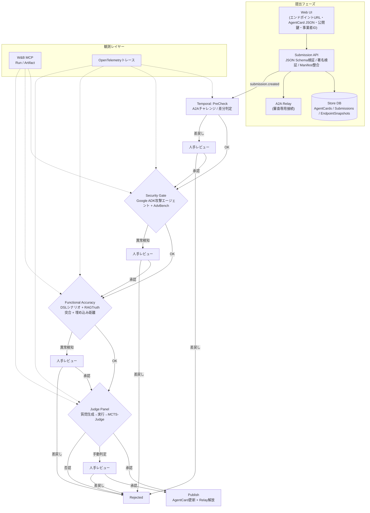

# Agent Store (PoC)

Agent Storeは、AIエージェントを「提出→審査→公開」するまで一気通貫で扱うための研究用サンドボックスです。Express（Node.js向けWebアプリフレームワーク）製API、Python製Sandbox Runner（自動テスト実行ツール）、Google Agent Development Kit（Google ADK: Google提供のエージェント実装テンプレート）ベースの攻撃/審査エージェント、AISI Inspect（外部評価ツール）連携ワーカーを組み合わせ、エージェントの安全性と機能性を検証します。

## エージェント登録と審査のやさしい流れ
以下では専門用語に簡単な説明を添えています。

1. **提出 (Submission API)**
   - Web UIで入力するもの: エンドポイントURL、署名付きAgentCard JSON（エージェントの自己紹介データ）、公開鍵（暗号署名の検証に使う鍵）、事業者ID。
   - Submission APIは次のチェックを実行します。
     - JSON Schema（データ構造ルール）でAgentCardの形式を確認。
     - デジタル署名検証で改ざんが無いか確認。
     - OpenAPI/manifest（エンドポイント仕様書）とAgentCardの記載が矛盾していないか確認。
   - 問題が無ければSubmissionレコードとEndpoint Snapshot（提出時点のエンドポイント情報）をDBに保存し、Temporal（分散ワークフローエンジン。段階的な処理を自動で進行させる基盤）へ`submission.created`イベントを送ります。

2. **PreCheck (Temporalステージ1)**
   - TemporalワークフローがSubmission IDを受け取り、A2Aチャレンジ（Agent-to-Agent通信の実在確認。Nonce=使い捨て乱数を送り、署名付き応答を得る手順）とスキーマ整合を再チェック。問題があればHuman Review（人手確認）に差し戻します。

3. **Security Gate (ステージ2)**
   - Sandbox Runner（Python CLI）がGoogle ADK製の攻撃エージェント（Attack Agent）を起動し、AdvBench（攻撃プロンプト集。`scripts/setup_aisev.sh`でクローンする`third_party/aisev`から取得）+AgentCard固有語彙でリライトしたプロンプトを生成。
   - Attack AgentはA2A Relay（Agent-to-Agent中継。審査中のみ実エンドポイントを開くゲートウェイ）経由で提出エージェントと実際に対話し、レスポンスログを`security/security_report.jsonl`として保存。拒否応答でない場合はHuman Reviewにエスカレーションします。

4. **Functional Accuracy (ステージ3)**
   - AgentCardの`useCases`からDSL（Domain Specific Language: ユースケースを機械可読にした言語）シナリオを作り、RAGTruth（正解データセット）で回答を照合。Embedding距離（数値化した回答の近さ）も計算し、想定外の振る舞いがあればHuman Reviewへ。

5. **Judge Panel (ステージ4)**
   - Question Generator→Execution Agent→判定エージェントで構成されたMCTS-Judge（Monte Carlo Tree Searchを応用した合議）を実行。Execution AgentはGoogle ADKテンプレートをベースにA2A Relay経由で提出エージェントと会話し、結果がグレーゾーンならHuman Review、明確な拒否なら即リジェクト。

6. **Human Review / Publish (最終ステージ)**
   - レビュワーUIで観点別の質問・証拠ログを確認し承認/差戻しを決定。承認するとAgentCardの`status`/`lastReviewedAt`を更新し、A2A Relay（審査完了まで実エンドポイントを隔離する中継サーバ）を解放してストアに公開されます。

## フロー図 (Mermaid)


## Getting Started
- `python3.13 -m venv .venv && source .venv/bin/activate`
- `pip install -r requirements.txt`
- `pip install -e sandbox-runner` でローカルCLIを有効化（Google ADKテンプレートを含むSandbox Runnerコマンドが利用可能になります）。
- `pytest` を実行するとリポジトリ内のユニットテストのみが走ります（`pytest.ini`で外部チェックアウトを除外）。
- W&B MCPを使ってステージログ/アーティファクトを収集する場合は `. .venv/bin/activate && export WANDB_DISABLED=false` を設定してから各コマンドを実行してください（デフォルトでは有効化されますが、明示的にフラグを確認できます）。Submission APIから`telemetry.wandb`フィールドでRun ID/Project/Entity/BaseURLを渡すと、同じRunをTemporalやSandbox Runnerが再利用できます。
- LLM Judgeを有効化したい場合はSubmission payloadの`telemetry.llmJudge`（例: `{ "enabled": true, "model": "gpt-4o-mini", "provider": "openai", "temperature": 0.1 }`）を指定すると、Temporalワークフロー経由でInspect Worker CLIの`--judge-llm-*`フラグに伝播されます。dry-runを強制したい場合は`dryRun: true`を指定してください。
- Security Gateをローカルで試す場合は `sandbox-runner` で
  ```bash
  python3.13 -m sandbox_runner.cli \
    --agent-id demo --revision rev1 --template google-adk \\
    --security-dataset third_party/aisev/backend/dataset/output/06_aisi_security_v0.1.csv \\
    --security-attempts 5 --output-dir sandbox-runner/artifacts
  ```
  を実行してください。`--security-endpoint` を指定すると実エージェントに対して攻撃プロンプトを送出できます（未指定の場合は`not_executed`として記録）。`--agent-card path/to/card.json` を渡すとユースケース語彙を組み合わせた攻撃テンプレートが生成され、`security/security_prompts.jsonl` に保存されます。
  - Ledger連携を試す場合は `SECURITY_LEDGER_ENDPOINT` / `SECURITY_LEDGER_TOKEN` / `SECURITY_LEDGER_DIR` を環境変数として設定すると、Security Gateのサマリハッシュが `audit-ledger/` に書き出され、必要に応じてHTTPエンドポイントへPOSTされます（詳細は [security-gate-ledger-plan.md](docs/design/security-gate-ledger-plan.md) を参照）。Judge Panelでも同様に `JUDGE_LEDGER_ENDPOINT` / `JUDGE_LEDGER_TOKEN` / `JUDGE_LEDGER_DIR` を設定すると `judge_summary.json` / `judge_report.jsonl` / `relay_logs.jsonl` のハッシュをLedgerへ送れます（Security Gateと同じディレクトリを共有する場合は変数を省略しても構いません）。
- Functional Accuracy（機能正確性）を試す場合は、AgentCard JSONとRAGTruthディレクトリを指定します。サンプルは`sandbox-runner/resources/ragtruth/sample.jsonl`にあります。DSLシナリオごとに回答を実行し、単語一致ベースの評価に加えてEmbedding距離（ベクトル類似度）も計算し、`functional_summary.json` に `embeddingAverageDistance` などのメトリクスを出力します。
  ```bash
  python3.13 -m sandbox_runner.cli \
    --agent-id demo --revision rev1 --template google-adk \\
    --agent-card path/to/agent_card.json \\
    --ragtruth-dir sandbox-runner/resources/ragtruth \\
    --output-dir sandbox-runner/artifacts
  ```
- Judge Panel（Inspect Worker側のGoogle ADKチェーン）を試す場合は `prototype/inspect-worker` で
  ```bash
  cd prototype/inspect-worker
  python scripts/run_eval.py \
    --agent-id demo --revision rev1 \\
    --artifacts ../../sandbox-runner/artifacts \\
    --manifest ../../prompts/aisi/manifest.tier3.json \\
    --enable-judge-panel --agent-card path/to/agent_card.json \\
    --judge-dry-run
  ```
  を実行すると `out/<agent>/<revision>/judge/judge_report.jsonl` と `judge_summary.json` が生成されます。`--relay-endpoint` を指定すればA2A Relay経由で実エージェントに質問できます。
- Human Review UIは `GET /review/ui/:submissionId` で確認できます。ステージ状況、W&Bダッシュボードリンク、再実行フォーム、承認/差戻しボタンが表示されます（バックエンド: `api/routes/reviews.ts`）。Judge セクションでは `llmScore` / `llmVerdict` のカード表示と Relay JSONL ログの整形プレビューを確認でき、CLI版ビューとNext.jsダッシュボードのどちらからでもLLM設定を再確認できます（実装メモ: [docs/design/judge-panel-human-review-implementation-20251110.md](docs/design/judge-panel-human-review-implementation-20251110.md)）。
- Next.js版のHuman Reviewダッシュボード（`review-ui/`）も用意しています。`cd review-ui && npm install && npm run dev`で起動し、`http://localhost:3000`からAPI経由で進捗・W&Bリンク・証拠ダウンロードを確認できます。

## W&B MCP 連携
- Sandbox Runnerは各実行でW&B Runを生成し（`wandb_run_id`は`sandbox-runner/src/sandbox_runner/cli.py`の`init_wandb_run`で払い出し）、`metadata.json`の`wandbMcp`にRun IDとステージサマリを記録します。
- ダッシュボードURLは `https://wandb.ai/<entity>/<project>/runs/<runId>`（CLIの`--wandb-entity`/`--wandb-project`/`--wandb-base-url`で指定）です。デフォルトは`project=agent-store-sandbox`,`entity=local`なので、実運用では `--wandb-base-url https://wandb.ai --wandb-entity <org> --wandb-project <proj>` のように明示してください。
- Security Gate実行時には`security/security_report.jsonl`をW&B Artifactとしてアップロードし、ステージ別サマリ（blocked件数、needsReview件数など）がRunのチャートに反映されます。Functional Accuracyを有効にした場合は`functional/functional_report.jsonl`も同じRunに保存され、Embedding距離の統計を確認できます。Judge Panel完了後は`prototype/inspect-worker`のCLIが同じRunへ`judge_report.jsonl`/`relay_logs.jsonl`を保存し、Temporal側が`sandbox-runner/artifacts/<rev>/metadata.json`の`wandbMcp.stages.judge`にLLM設定と集計値を追記します。`--wandb-run-id`を渡すと既存Runへ継続記録できます。
- 運用方針: PoCや素早い可視化が目的なら公式SaaS( `https://wandb.ai` )が便利ですが、審査ログを外部に出せない場合はローカル/Private CloudのW&B MCPサーバを用意し`--wandb-base-url http://localhost:XXXX`のように切り替えてください。

## Key Components
- `api/`: Submission / Catalog APIルート・サービス。
- `sandbox-runner/`: Google ADKベースの攻撃/審査エージェントを起動し、AdvBenchテンプレやDSLシナリオを実行してpolicy/fairness成果物を生成するCLI。Functional DSLとRAGTruthの運用方針は [docs/design/functional-dsl-plan.md](docs/design/functional-dsl-plan.md) にまとめています。
- `prototype/inspect-worker/`: AISI Inspectワークフローと連携し、Judgeエージェントの結果をリプレイ。
- `docs/`: 設計メモと研究検討資料。Functional DSL/RAGTruth運用は [docs/design/functional-dsl-plan.md](docs/design/functional-dsl-plan.md)、Security Gate監査連携は [docs/design/security-gate-ledger-plan.md](docs/design/security-gate-ledger-plan.md) と [docs/design/sandbox-runner-implementation-plan.md](docs/design/sandbox-runner-implementation-plan.md) を参照。

## 実装ステータス (2025-11-11時点)
| 機能領域 | 状態 | メモ |
| --- | --- | --- |
| Submission API（提出〜スナップショット保存） | ✅ 実装済み | JSON Schema/署名/Manifest検証とDB保存を完了。Temporal連携イベントも送出。 |
| Temporalワークフロー（PreCheck→Publish） | ✅ 実装済み | `runSecurityGate`/`runFunctionalAccuracy`/`runJudgePanel` が実CLIを叩き、`queryProgress`へW&B/アーティファクト情報を返却。 |
| Sandbox RunnerのAdvBench統合 | ✅ 実装済み | AgentCard語彙を差し込んだ攻撃テンプレ生成・Relay実行・カテゴリ別統計・W&B/Temporal連携まで完了。 |
| Functional DSL + RAGTruth突合 | ✅ 実装済み | AgentCardシナリオ生成 → Relay実行 → RAGTruth照合に加え、Embedding距離メトリクスを算出しTemporal/UI/W&Bへ返却。 |
| Judge Panel (MCTS-Judge) | 🚧 部分実装 | Inspect Worker CLIでRelayログ＋MCTS評価＋LLM判定を実行し、TemporalアクティビティからLedger（summary/report/relayハッシュ）へ記録できるようにした。Human Review UIでのLLMカード表示・再実行設定保持は継続中（詳細: [judge-panel-human-review-implementation-20251110.md](docs/design/judge-panel-human-review-implementation-20251110.md)）。 |
| Human Review UI連携 | ✅ 実装済み | `/review/*` RESTとNext.jsダッシュボードを実装。証拠JSON整形表示・再実行・承認/差戻しが可能。 |
| W&B MCPトレース連携 | 🚧 部分実装 | Sandbox Runner/Inspect WorkerからRun IDを共有し、ステージサマリ/Artifactを記録。Human Review連携ログは今後。 |

> ※実装や設計の更新を行った際は、必ず本READMEのステータステーブルと該当セクションを更新してください。

## 今後の優先タスク
1. **Judge Panel UI & Relay可視化強化**: Human Review UI（Next.js/HTMLビュー）で `llmScore`/`llmVerdict` カード表示、RelayログJSONL整形表示、再実行フォームのLLM設定デフォルト化を実装する（参照: [docs/design/judge-panel-human-review-implementation-20251110.md](docs/design/judge-panel-human-review-implementation-20251110.md)).
2. **LLMメタデータのW&B/Temporal同期**: `queryProgress` で得たLLM設定とスコアをSandbox Runner・Inspect Worker双方のW&Bメタデータ（`wandbMcp`）に書き込み、審査証跡を一元化する（参照: [docs/design/security-gate-ledger-plan.md](docs/design/security-gate-ledger-plan.md)).
3. **Inspect Worker Relay実行＆判定ロジック強化**: Relay HTTPエラー処理、レスポンスログ保存、禁止語検知、LLMエラー報告を拡張し、Ledger/W&B/READMEの要件に沿ってJudge結果を詳細化する。
4. **Temporal/Judgeテスト拡充**: `prototype/temporal-review-workflow` のVitestでJudge LedgerやLLM設定伝播の回帰テストを追加し、ドキュメントの完了条件に沿って検証ログをREADMEへ反映する。

## Contributor Guide
完全なコントリビュータガイド、コーディング規約、PR要件は[`AGENTS.md`](AGENTS.md)を参照してください。
