# Agent Store (PoC)

Agent Storeは、AIエージェントを「提出→審査→公開」するまで一気通貫で扱うための研究用サンドボックスです。Express（Node.js向けWebアプリフレームワーク）製API、Python製Sandbox Runner（自動テスト実行ツール）、Google Agent Development Kit（Google ADK: Google提供のエージェント実装テンプレート）ベースの攻撃/審査エージェント、AISI Inspect（外部評価ツール）連携ワーカーを組み合わせ、エージェントの安全性と機能性を検証します。

## エージェント登録と審査のやさしい流れ
以下では専門用語に簡単な説明を添えています。

1. **提出 (Submission API)**
   - Web UIで入力するもの: エンドポイントURL、署名付きAgentCard JSON（エージェントの自己紹介データ）、公開鍵（暗号署名の検証に使う鍵）、事業者ID。
   - Submission APIは次のチェックを実行します。
     - JSON Schema（データ構造ルール）でAgentCardの形式を確認。
     - デジタル署名検証で改ざんが無いか確認。
     - OpenAPI/manifest（エンドポイント仕様書）とAgentCardの記載が矛盾していないか確認。
   - 問題が無ければSubmissionレコードとEndpoint Snapshot（提出時点のエンドポイント情報）をDBに保存し、Temporal（分散ワークフローエンジン。段階的な処理を自動で進行させる基盤）へ`submission.created`イベントを送ります。

2. **PreCheck (Temporalステージ1)**
   - TemporalワークフローがSubmission IDを受け取り、A2Aチャレンジ（Agent-to-Agent通信の実在確認。Nonce=使い捨て乱数を送り、署名付き応答を得る手順）とスキーマ整合を再チェック。問題があればHuman Review（人手確認）に差し戻します。

3. **Security Gate (ステージ2)**
   - Sandbox Runner（Python CLI）がGoogle ADK製の攻撃エージェント（Attack Agent）を起動し、AdvBench（攻撃プロンプト集。`scripts/setup_aisev.sh`でクローンする`third_party/aisev`から取得）+AgentCard固有語彙でリライトしたプロンプトを生成。
   - Attack AgentはA2A Relay（Agent-to-Agent中継。審査中のみ実エンドポイントを開くゲートウェイ）経由で提出エージェントと実際に対話し、レスポンスログを`security/security_report.jsonl`として保存。拒否応答でない場合はHuman Reviewにエスカレーションします。

4. **Functional Accuracy (ステージ3)**
   - AgentCardの`useCases`からDSL（Domain Specific Language: ユースケースを機械可読にした言語）シナリオを作り、RAGTruth（正解データセット）で回答を照合。Embedding距離（数値化した回答の近さ）も計算し、想定外の振る舞いがあればHuman Reviewへ。

5. **Judge Panel (ステージ4)**
   - Question Generator→Execution Agent→判定エージェントで構成されたMCTS-Judge（Monte Carlo Tree Searchを応用した合議）を実行。Execution AgentはGoogle ADKテンプレートをベースにA2A Relay経由で提出エージェントと会話し、結果がグレーゾーンならHuman Review、明確な拒否なら即リジェクト。

6. **Human Review / Publish (最終ステージ)**
   - レビュワーUIで観点別の質問・証拠ログを確認し承認/差戻しを決定。承認するとAgentCardの`status`/`lastReviewedAt`を更新し、A2A Relay（審査完了まで実エンドポイントを隔離する中継サーバ）を解放してストアに公開されます。

## フロー図 (Mermaid)

```mermaid
flowchart TD
  subgraph 提出フェーズ
    A["Web UI<br/>(エンドポイントURL・AgentCard JSON・公開鍵・事業者ID)"] --> B["Submission API<br/>JSON Schema検証 / 署名検証 / Manifest整合"]
    B --> C[("Store DB<br/>AgentCards / Submissions / EndpointSnapshots")]
    B --> D["A2A Relay<br/>(審査専用接続)"]
  end

  B -->|submission.created| E["Temporal: PreCheck<br/>A2Aチャレンジ / 差分判定"]
  E -->|OK| F{"Security Gate<br/>Google ADK攻撃エージェント + AdvBench"}
  E -- 差戻し --> H0["人手レビュー"]

  F -->|OK| G{"Functional Accuracy<br/>DSLシナリオ + RAGTruth突合 + 埋め込み距離"}
  F -- 異常検知 --> H1["人手レビュー"]

  G -->|OK| I{"Judge Panel<br/>質問生成→実行→MCTS-Judge"}
  G -- 異常検知 --> H2["人手レビュー"]

  I -->|承認| J["Publish<br/>AgentCard更新 + Relay解放"]
  I -- 手動判定 --> H3["人手レビュー"]
  I -- 否認 --> K["Rejected"]

  H0 -->|承認| F
  H1 -->|承認| G
  H2 -->|承認| I
  H3 -->|承認| J
  H0 -->|差戻し| K
  H1 -->|差戻し| K
  H2 -->|差戻し| K
  H3 -->|差戻し| K

  subgraph 観測レイヤー
    W["W&B MCP<br/>Run / Artifact"]
    T["OpenTelemetryトレース"]
  end
  W -.-> F
  W -.-> G
  W -.-> I
  T -.-> E
  T -.-> F
  T -.-> G
  T -.-> I
```


## Getting Started

### Docker Composeで一括起動（推奨）

全サービス（Submission用PostgreSQL、Temporal用PostgreSQL、Temporal、API、Inspect Worker、Review UI）を一括で起動する場合：

```bash
# 1. 環境変数の設定（オプション）
cp .env.example .env
# 必要に応じて .env を編集
> `.env.example` には `POSTGRES_PASSWORD` / `DATABASE_URL` / `TEMPORAL_DB_*` / `ALLOWED_ORIGINS` / `RATE_LIMIT_*` などの機微情報が含まれます。環境に合わせて書き換え、Secrets Manager等で管理してください。

# 2. AdvBenchデータセットのセットアップ
bash scripts/setup_aisev.sh

# 3. コンテナをビルド（CIと同じコマンド）
docker compose build api review-ui temporal-worker inspect-worker

# 4. 全サービスを起動
docker compose up -d

# 5. ログの確認
docker compose logs -f

# 6. サービスの停止
docker compose down

# 7. データを含めて完全に削除
docker compose down -v

> Docker Composeは `.env` に定義した `DATABASE_URL` / `TEMPORAL_ADDRESS` / `WANDB_*` / `ALLOWED_ORIGINS` / `RATE_LIMIT_*` などの値をそのまま各コンテナへ渡します。本番環境ではSecretsストアを利用し、公開リポジトリに値を残さないようにしてください。
```

起動後、以下のURLでアクセスできます：
- **API**: http://localhost:3000
- **Review UI**: http://localhost:3001
- **Temporal UI**: http://localhost:8233
- **Health Check**: http://localhost:3000/health

各サービスのコンテナ名：
- `agent-store-postgres` - Submission/APサーバ用PostgreSQLデータベース
- `agent-store-temporal-postgres` - Temporalサーバ専用PostgreSQLデータベース
- `agent-store-temporal` - Temporalサーバ
- `agent-store-temporal-worker` - Temporalワーカー
- `agent-store-api` - Express APIサーバ
- `agent-store-review-ui` - Next.js Review UI
- `agent-store-inspect-worker` - Inspect Worker（Judge Panel CLI + W&Bロガー）

GitHub Actionsの`Docker Compose Smoke Test`ワークフロー（Continuous Integration=継続的統合の一環で、PRごとに自動実行されるE2E起動テスト）は `.env.example` を基にstackを立ち上げ、`/health` や Temporal CLI(`tctl cluster health`)を確認してから後片付けします。ローカルと同じ手順で失敗が再現されるため、Docker構成の回 regress（回帰=以前動いていたものが動かなくなること）を早期に検知できます。

### ローカル開発環境でのセットアップ

Docker Composeを使わずに個別に起動する場合：

- `python3.13 -m venv .venv && source .venv/bin/activate`
- `pip install -r requirements.txt`
- `pip install -e sandbox-runner` でローカルCLIを有効化（Google ADKテンプレートを含むSandbox Runnerコマンドが利用可能になります）。
- `pytest` を実行するとリポジトリ内のユニットテストのみが走ります（`pytest.ini`で外部チェックアウトを除外）。
- W&B MCPを使ってステージログ/アーティファクトを収集する場合は `. .venv/bin/activate && export WANDB_DISABLED=false` を設定してから各コマンドを実行してください（デフォルトでは有効化されますが、明示的にフラグを確認できます）。Submission APIから`telemetry.wandb`フィールドでRun ID/Project/Entity/BaseURLを渡すと、同じRunをTemporalやSandbox Runnerが再利用できます。
- LLM Judgeを有効化したい場合はSubmission payloadの`telemetry.llmJudge`（例: `{ "enabled": true, "model": "gpt-4o-mini", "provider": "openai", "temperature": 0.1 }`）を指定すると、Temporalワークフロー経由でInspect Worker CLIの`--judge-llm-*`フラグに伝播されます。dry-runを強制したい場合は`dryRun: true`を指定してください。
- Security Gateをローカルで試す場合は `sandbox-runner` で
  ```bash
  python3.13 -m sandbox_runner.cli \
    --agent-id demo --revision rev1 --template google-adk \\
    --security-dataset third_party/aisev/backend/dataset/output/06_aisi_security_v0.1.csv \\
    --security-attempts 5 --output-dir sandbox-runner/artifacts
  ```
  を実行してください。`--security-endpoint` を指定すると実エージェントに対して攻撃プロンプトを送出できます（未指定の場合は`not_executed`として記録）。`--agent-card path/to/card.json` を渡すとユースケース語彙を組み合わせた攻撃テンプレートが生成され、`security/security_prompts.jsonl` に保存されます。
  - Ledger連携を試す場合は `SECURITY_LEDGER_ENDPOINT` / `SECURITY_LEDGER_TOKEN` / `SECURITY_LEDGER_DIR` を環境変数として設定すると、Security Gateのサマリハッシュが `audit-ledger/` に書き出され、必要に応じてHTTPエンドポイントへPOSTされます（詳細は [security-gate-ledger-plan.md](docs/design/security-gate-ledger-plan.md) を参照）。Functional Accuracy向けには `FUNCTIONAL_LEDGER_*` を、Judge Panel向けには `JUDGE_LEDGER_*` を設定できます。いずれも未設定の場合はSecurity Gate用のディレクトリ/エンドポイントを自動的に共有します。
- Functional Accuracy（機能正確性）を試す場合は、AgentCard JSONとRAGTruthディレクトリを指定します。サンプルは`sandbox-runner/resources/ragtruth/sample.jsonl`にあります。DSLシナリオごとに回答を実行し、単語一致ベースの評価に加えてEmbedding距離（ベクトル類似度）も計算し、`functional_summary.json` に `embeddingAverageDistance` などのメトリクスを出力します。
  ```bash
  python3.13 -m sandbox_runner.cli \
    --agent-id demo --revision rev1 --template google-adk \\
    --agent-card path/to/agent_card.json \\
    --ragtruth-dir sandbox-runner/resources/ragtruth \\
    --output-dir sandbox-runner/artifacts
  ```
- Judge Panel（Inspect Worker側のGoogle ADKチェーン）を試す場合は `prototype/inspect-worker` で
  ```bash
  cd prototype/inspect-worker
  python scripts/run_eval.py \
    --agent-id demo --revision rev1 \\
    --artifacts ../../sandbox-runner/artifacts \\
    --manifest ../../prompts/aisi/manifest.tier3.json \\
    --enable-judge-panel --agent-card path/to/agent_card.json \\
    --judge-dry-run
  ```
  を実行すると `out/<agent>/<revision>/judge/judge_report.jsonl` と `judge_summary.json` が生成されます。`--relay-endpoint` を指定すればA2A Relay経由で実エージェントに質問できます。Relay呼び出しは最大3回まで自動リトライし、HTTPエラー履歴・レスポンススニペット・禁止語検知（パスワード/APIキー/SSN/秘密鍵等）を `judge_report.jsonl` と `relay_logs.jsonl` に書き出します。
  - Inspect Workerの単体テストは専用の仮想環境で実行します。
    ```bash
    cd prototype/inspect-worker
    python3 -m venv .venv
    . .venv/bin/activate
    pip install -r requirements.txt
    pip install pytest  # requirementsに含まれないため個別導入
    PYTHONPATH=./ python -m pytest
    ```
    Trace IDやLLM override連携の挙動は `tests/test_judge_panel.py` / `tests/test_run_eval.py` で検証しています。
    - CIやローカル自動化では `scripts/test_inspect_worker.sh` を呼び出すと仮想環境の作成から `pytest` 実行までを一括で処理できます。
  - Human Review UIは `GET /review/ui/:submissionId` で確認できます。ステージ状況、W&Bダッシュボードリンク、再実行フォーム、承認/差戻しボタンが表示されます（バックエンド: `api/routes/reviews.ts`）。Judge セクションでは `llmScore` / `llmVerdict` のカード表示と Relay JSONL ログの整形プレビュー・検索ボックスを備え、JSONLを取得済みのままステータス/禁止語でフィルタできます。Manual/Reject になった質問IDの一覧と再実行理由プレフィルボタン、LLM override 履歴、RelayトレースIDも同画面で確認でき、再実行フォームにワンクリックで反映可能です。各Judgeカードには W&B Run と `judge_report.jsonl` / `relay_logs.jsonl` へのディープリンクが常設され、Playwright (`tests/e2e/judge-manual.spec.ts`) で手動判定フロー＋リンク挙動を検証しています。Functional Accuracy セクションでは平均距離・Embedding距離メトリクス、Fail上位シナリオ、応答/期待値の差分に加えて、`ragtruthRecords` 件数と `ragTruthArtifact`/`promptsArtifact` のパスをカード表示し、ワンクリックでJSONLダウンロードやパスコピーができます。また、RAGTruth差分ビュー（回答 vs 期待値）と Embedding距離ヒストグラムを追加し、問題シナリオの傾向を即座に把握できます。Humanステージには Judge manual 判定を受けた際のバナーと承認メモ/添付一覧が表示され、レビュワーが保留中の理由を即座に把握できます。Judge再実行時はフォームの「LLM設定を上書きする」にチェックを入れることで、`model` / `provider` / `temperature(0〜2)` / `maxOutputTokens(>0整数)` / `dryRun(true|false|inherit)` を指定できます。必須・数値項目はクライアント側でリアルタイム検証され、エラー時は送信ボタンが無効化されます（Next.js側のテスト: `cd review-ui && npm run test` / `tests/judgeOverride.test.ts`、Temporal CLI伝播のテスト: `cd prototype/temporal-review-workflow && npm run test` / `src/__tests__/llmOverride.test.ts`）。Security/Functional/JudgeステージのLedger（監査台帳）はカード化され、`workflowId`/`workflowRunId`/`sourceFile`/`digest`の確認、パスのクリップボードコピー、`/review/ledger/download` 経由のローカルファイル取得ボタンを同じビューで操作できます。Ledgerファイルが欠損していても `sourceFile` をFallbackとして配信し、レスポンスヘッダー `X-Ledger-Fallback: true` で復元経路を示します。LedgerがHTTPエンドポイントにしか存在しない場合でも `/review/ledger/download` が自動的にフェッチしてキャッシュし、リモートステータス（HTTPコード/応答時間/エラー）をカードおよびレスポンスヘッダーで可視化します。また `recordStageEvent` が生成したイベント履歴は `/review/events/:submissionId` 経由で取得され、UI上のタイムラインテーブルでRetry理由やHuman決裁ログを直接参照できます（詳細: [review-ledger-api-20251111.md](docs/design/review-ledger-api-20251111.md)、[judge-panel-human-review-implementation-20251110.md](docs/design/judge-panel-human-review-implementation-20251110.md)、[wandb-run-propagation-20251110.md](docs/design/wandb-run-propagation-20251110.md)）。
  - Manual判定が出た際はJudgeバナーに「再実行フォームへプリセット」「証拠ビュー」ボタンが表示され、該当質問のJudgeカードやArtifactビューへスクロールできます。JudgeカードのLLM設定プリセット／W&Bリンク／ArtifactリンクはPlaywright E2Eテストで毎回検証されるため、手動判定フロー全体をUIだけで追跡できます。
  - LedgerカードにはHTTP送信ステータス（成功/失敗/試行回数/エラーメッセージ）が表示され、Ledger APIがダウンしてもHuman Review UIから即座に判別できます。`JUDGE_LEDGER_*` や `FUNCTIONAL_LEDGER_*` のHTTP送信が失敗した場合でもワークフロー自体は継続し、UI上に「HTTP送信: 失敗」ラベルとエラー内容が提示されます。
  - Ledgerカードは `/review/ledger/download` の現在の可用性もリアルタイムでチェックし、ローカルファイルが削除/移動されていれば「ダウンロード: 不可」と赤枠で通知、Fallback経路が使われている場合はその旨を表示します。ダウンロードリンクは自動的に `/review/ledger/download?submissionId=<id>&stage=<stage>` に張り替えられるため、UIから直接再取得できます。
- Next.js版のHuman Reviewダッシュボード（`review-ui/`）も用意しています。`cd review-ui && npm install && npm run dev`で起動し、`http://localhost:3000`からAPI経由で進捗・W&Bリンク・証拠ダウンロードを確認できます。
- Human Review UIの単体テストはVitest＋Testing Libraryを利用しています。`cd review-ui && npm run test` でフォームバリデーションやUIロジックの検証が実行できます。

### CI / 自動テスト

- **Docker Compose Build**（CI=Continuous Integration=継続的統合）: `docker compose build` をPRごとに検証し、Dockerfileや依存更新によるビルド失敗を即検知します。
- **Docker Compose Smoke Test**（E2E=End-to-End=端から端の一連動作確認）: 本コミットで追加。`docker compose up` で `postgres` / `temporal-postgres` / `temporal` / `temporal-worker` / `api` / `inspect-worker` を起動し、`curl http://localhost:3000/health` と `tctl cluster health` を用いてAPIおよびTemporalの可用性を自動チェック後、`docker compose down -v` で環境を掃除します。
- **Inspect Worker Tests**: `scripts/test_inspect_worker.sh` をGitHub Actionsで実行し、Judge Panel/Relayロジックのpytestを常に走らせます（`WANDB_DISABLED=true`でネットワーク資格情報が不要なDry Run相当の検証）。
- **Review UI (Next.js) テスト**: `cd review-ui && npm run test` でVitest＋Testing Libraryによるフォーム・バリデーションを実行。Judge manualフローのE2E検証に向けてPlaywright導入を予定しており、`npx playwright test` で `/review/progress` のモックレスポンスを用いたUI自動テストを実行する計画です。
- Playwright E2Eテストのシナリオとセットアップ手順は [docs/testing/review-ui-playwright-plan.md](docs/testing/review-ui-playwright-plan.md) を参照してください。
- **Review UI Playwright (CI)**: `.github/workflows/review-ui-playwright.yml` が `npm run test -- --run`（Vitest）と `npm run test:e2e`（Playwright）をPRごとに実行し、Judge Panelのmanualフローが退行していないかを自動検証します。

### APIセキュリティ指針

- `/api/review/*` 系のファイル配信APIは `sanitizeSegment` + `ensureWithinRepo` で `submissionId` / `agentRevisionId` / `agentId` / `stage` を検証し、パストラバーサル（`../` 等によるリポジトリ外アクセス）を防止しています。新しいダウンロード系エンドポイントを追加する際は必ず同じヘルパーを再利用し、Stage名は `StageName` 列挙（`precheck|security|functional|judge|human|publish`）で制限してください。
- Ledgerファイル取得（`/review/ledger/download`）は `X-Ledger-Source` / `X-Ledger-Fallback` ヘッダーで配信元を可視化します。ファイルが欠損した場合は `fallback: true` のレスポンスで監査ルートを示し、UIやW&BメタデータのLedgerカードで同じ情報が参照できるようにしています。
- `/review/ledger/download` が404を返す場合は `error=primary_missing` / `fallback_missing` と `status=primary|fallback` を返すので、UIやW&Bイベントは欠損パターンを区別して表示できます。レスポンスヘッダー `X-Ledger-Status` でもどちらのファイルが配信されたか（primary/fallback）を判別可能です。
- すべてのSubmission/Stage IDはSAFE_SEGMENT (`^[A-Za-z0-9._-]+$`) でホワイトリスト化されるため、外部入力をそのまま `fs` や `spawn` に渡さないでください。Express Routerに新規パラメータが増える場合は `BadRequestError` を投げて400を返す実装に合わせます。

## W&B MCP 連携
- Sandbox Runnerは各実行でW&B Runを生成し（`wandb_run_id`は`sandbox-runner/src/sandbox_runner/cli.py`の`init_wandb_run`で払い出し）、`metadata.json`の`wandbMcp`にRun IDとステージサマリを記録します。
- ダッシュボードURLは `https://wandb.ai/<entity>/<project>/runs/<runId>`（CLIの`--wandb-entity`/`--wandb-project`/`--wandb-base-url`で指定）です。デフォルトは`project=agent-store-sandbox`,`entity=local`なので、実運用では `--wandb-base-url https://wandb.ai --wandb-entity <org> --wandb-project <proj>` のように明示してください。
- Temporalの `recordStageEvent` は retry / manual review / Ledgerアップロード失敗 などのイベントを `wandbMcp.events` と W&B Run 両方へ送信し、`event/severity=(info|warn|error)` を指標として記録します。Ledger HTTP送信が失敗するとW&B上にも `ledger_upload_failed` が赤で残るため、UIを開かなくても異常を検知できます。
- Security Gate実行時には`security/security_report.jsonl`をW&B Artifactとしてアップロードし、ステージ別サマリ（blocked件数、needsReview件数など）がRunのチャートに反映されます。Functional Accuracyを有効にした場合は`functional/functional_report.jsonl`も同じRunに保存され、Embedding距離の統計を確認できます。Judge Panel完了後は`prototype/inspect-worker`のCLIが同じRunへ`judge_report.jsonl`/`relay_logs.jsonl`を保存し、Temporal側が`sandbox-runner/artifacts/<rev>/metadata.json`の`wandbMcp.stages.judge`にLLM設定と集計値（LLMコール数/Relayエラー/リトライ回数/禁止語フラグなど）を追記します。Human Review決裁を受信すると`wandbMcp.events`に`human_decision`イベントを追加し、Ledgerダイジェストと承認/差戻しメモをRun上で追跡できます。`--wandb-run-id`を渡すか、SubmissionでrunId未指定の場合は自動で `submission-<uuid>` が払い出され、デフォルト `entity=local`, `project=agent-store-sandbox`, `baseUrl=https://wandb.ai` を使用します（環境変数 `WANDB_DEFAULT_*` で上書き可能）。
- 運用方針: PoCや素早い可視化が目的なら公式SaaS( `https://wandb.ai` )が便利ですが、審査ログを外部に出せない場合はローカル/Private CloudのW&B MCPサーバを用意し`--wandb-base-url http://localhost:XXXX`のように切り替えてください。

## Key Components
- `api/`: Submission / Catalog APIルート・サービス。
- `sandbox-runner/`: Google ADKベースの攻撃/審査エージェントを起動し、AdvBenchテンプレやDSLシナリオを実行してpolicy/fairness成果物を生成するCLI。Functional DSLとRAGTruthの運用方針は [docs/design/functional-dsl-plan.md](docs/design/functional-dsl-plan.md) にまとめています。
- `prototype/inspect-worker/`: AISI Inspectワークフローと連携し、Judgeエージェントの結果をリプレイ。
- `docs/`: 設計メモと研究検討資料。Functional DSL/RAGTruth運用は [docs/design/functional-dsl-plan.md](docs/design/functional-dsl-plan.md)、Security Gate監査連携は [docs/design/security-gate-ledger-plan.md](docs/design/security-gate-ledger-plan.md) と [docs/design/sandbox-runner-implementation-plan.md](docs/design/sandbox-runner-implementation-plan.md) を参照。

## 実装ステータス (2025-11-12時点)
| 機能領域 | 状態 | メモ |
| --- | --- | --- |
| Submission API（提出〜スナップショット保存） | ✅ 実装済み | JSON Schema/署名/Manifest検証とDB保存を完了。Temporal連携イベントも送出。 |
| Temporalワークフロー（PreCheck→Publish） | ✅ 実装済み | `runSecurityGate`/`runFunctionalAccuracy`/`runJudgePanel` が実CLIを叩き、`queryProgress`へW&B/アーティファクト情報を返却。 |
| Sandbox RunnerのAdvBench統合 | ✅ 実装済み | AgentCard語彙を差し込んだ攻撃テンプレ生成・Relay実行・カテゴリ別統計・W&B/Temporal連携まで完了。 |
| Functional DSL + RAGTruth突合 | ✅ 実装済み | AgentCardシナリオ生成 → Relay実行 → RAGTruth照合に加え、Embedding距離メトリクスとLedger（`functional_ledger_entry.json`）を生成し、Temporal/UI/W&Bへ返却。 |
| Judge Panel (MCTS-Judge) | 🚧 部分実装 | Inspect Worker CLIでRelayログ＋MCTS評価＋LLM判定を実行し、Ledger（summary/report/relayハッシュ）、LLM override履歴イベント、Trace ID付きJudgeカード/Relayログ表示をHuman Review UIへ供給済み。Ledgerアップロード失敗や再実行Mrnに応じた `warnings` がTemporal／API／Next.jsに伝播するようになった。残課題: manual判定時のUIフロー仕上げ、Judge verdictのW&Bスクリーンショット連携、CIでのinspect-worker統合テスト強化（詳細: [judge-panel-human-review-implementation-20251110.md](docs/design/judge-panel-human-review-implementation-20251110.md)）。 |
| Human Review UI連携 | ✅ 実装済み | `/review/*` RESTとNext.jsダッシュボードを実装。証拠JSON整形表示・再実行・承認/差戻しが可能。 |
| W&B MCPトレース連携 | ✅ 実装済み | Security/Functional/Judge/Human各ステージのサマリ・Ledger・LLM設定を `metadata.json` / `wandbMcp.stages` に集約し、`/review/ledger` とW&B Runの両方からリプレイできる。Judge PanelはW&B Configへ LLM override情報・Relay指標（manual/reject/relay error ratio 等）を自動書き込み、Dashboard単体で審査履歴とトラブル箇所を把握できる。 |

> ※実装や設計の更新を行った際は、必ず本READMEのステータステーブルと該当セクションを更新してください。

## 今後の優先タスク
1. **Judge Panel仕上げ**: Inspect WorkerのMCTS-Judge結果をUIに完全表示し、manual 判定時の再実行ワークフローを最後まで仕上げる。
   - Deep Link（W&B / Judgeレポート / Relayログ）とPlaywrightシナリオは追加済み。次は W&B Run のスクリーンショット/Artifactsプレビューをカードに埋め込み、Human承認フォームに貼り付けできるようにする。
   - Manual判定→LLM override→Human承認の一連フローをPlaywrightでさらに拡張し、LLM設定プリセット→再実行→イベントタイムラインまでを1本のシナリオで確認する。
   - Judgeカードのディープリンク情報をW&Bイベント（`event/judge/…`）にも書き込み、W&Bから直接HTMLビューへ戻れるようにする（詳細: [docs/design/judge-panel-human-review-implementation-20251110.md](docs/design/judge-panel-human-review-implementation-20251110.md)）。
2. **Ledger耐障害性の強化（残タスク）**: `/review/ledger/download` はリモートURLからの自動再取得とヘルスチェックを実装済み。次はHTTP送信失敗時にバックグラウンド再送（Temporal Activity or CLI）を行い、Ledger APIの健全性をW&BイベントとUI双方で可視化する。必要に応じて `LEDGER_REMOTE_TIMEOUT_MS` / `LEDGER_REMOTE_MAX_BYTES` をTerraformやCIで注入できるようにする。
3. **FunctionalリプレイUI**: RAGTruth差分ビューとEmbedding距離ヒストグラムを追加済み。次はRAGTruth JSONLの全文検索/シナリオフィルタ、Embedding距離の閾値アラート、RAGTruth編集リンクをUIに統合する。
4. **Inspect Workerトレーサビリティ**: Judge Panel CLIがW&BタイムラインやイベントAPIと整合するよう、LLM呼び出し/RelayリトライのトレースIDをArtifacts・Ledgerへ書き込み、UIで辿れるようにする。

## ドキュメント

- **[DOCKER_QUICKSTART.md](DOCKER_QUICKSTART.md)** - Docker Composeを使った簡単なセットアップガイド
- **[CODE_REVIEW_REPORT.md](docs/CODE_REVIEW_REPORT.md)** - ソースコード全体のレビューレポート（セキュリティ、パフォーマンス、改善提案）
- **[AGENTS.md](AGENTS.md)** - コントリビュータガイド、コーディング規約、PR要件

## Contributor Guide
完全なコントリビュータガイド、コーディング規約、PR要件は[`AGENTS.md`](AGENTS.md)を参照してください。
