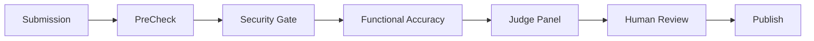

# Agent Store - 手動テスト手順書

## 📋 前提条件

すべてのサービスが起動していることを確認：
```bash
docker compose ps
```

期待される出力: 以下の6つのサービスが`Up`または`Running`状態
- agent-store-api
- agent-store-postgres
- agent-store-temporal-postgres
- agent-store-temporal
- agent-store-temporal-worker
- agent-store-review-ui

## 🌐 アクセス先URL

| サービス | URL | 用途 |
|---------|-----|------|
| **Review UI** | http://localhost:3001 | レビュー状況の確認・Human Review |
| **API** | http://localhost:3002 | エージェント提出・状態確認 |
| **Temporal Web UI** | http://localhost:8233 | ワークフロー管理・デバッグ |

---

## テストシナリオ

### 🧪 シナリオ1: APIヘルスチェック

最も基本的な動作確認です。

```bash
# ヘルスチェック
curl http://localhost:3002/health
```

**期待される出力:**
```json
{"status":"ok","timestamp":"2025-11-13T04:01:13.286Z"}
```

**確認ポイント:**
- ✅ HTTPステータス 200
- ✅ JSONレスポンスに`status: "ok"`が含まれる

---

### 🧪 シナリオ2: Review UIの表示確認

ブラウザで動作を確認します。

1. **Review UIを開く:**
   ```
   http://localhost:3001
   ```

2. **確認ポイント:**
   - ✅ Agent Store Review UIのページが表示される
   - ✅ 初期状態では提出物のリストは空
   - ✅ JavaScriptエラーがコンソールにない（ブラウザのDevToolsで確認）

---

### 🧪 シナリオ3: Temporal Web UIの確認

Temporalのダッシュボードを確認します。

1. **Temporal Web UIを開く:**
   ```
   http://localhost:8233
   ```

2. **確認ポイント:**
   - ✅ Temporalのダッシュボードが表示される
   - ✅ Namespace: `default` が選択されている
   - ✅ Workflowsタブで現在はワークフローが0件

---

### 🧪 シナリオ4: エージェント提出テスト（完全なE2Eテスト）

実際にエージェントを提出してレビューパイプラインを動かします。

#### Step 1: テスト用のSubmissionを準備

```bash
cat > /tmp/test-submission.json << 'EOF'
{
  "agentCard": {
    "id": "550e8400-e29b-41d4-a716-446655440000",
    "agentId": "550e8400-e29b-41d4-a716-446655440001",
    "defaultLocale": "en",
    "status": "draft",
    "translations": [
      {
        "locale": "en",
        "displayName": "Test Agent",
        "shortDescription": "A test agent for manual testing",
        "capabilities": ["text-processing", "data-analysis"]
      }
    ],
    "executionProfile": {
      "inputFormat": "application/json",
      "outputFormat": "application/json",
      "entrypoint": "main.py",
      "dependencies": []
    }
  },
  "signature": "test-signature-123",
  "sourceCodeTarball": "https://example.com/agent.tar.gz",
  "metadata": {
    "submittedBy": "test-user",
    "timestamp": "2025-11-13T04:00:00Z"
  }
}
EOF
```

#### Step 2: エージェントを提出

```bash
curl -X POST http://localhost:3002/v1/submissions \
  -H "Content-Type: application/json" \
  -d @/tmp/test-submission.json
```

**期待される出力:**
```json
{
  "submissionId": "uuid-generated-by-server",
  "state": "pending",
  "manifestWarnings": []
}
```

**確認ポイント:**
- ✅ HTTPステータス 202 (Accepted)
- ✅ `submissionId`が返される（UUIDフォーマット）
- ✅ `state`が`"pending"`

**⚠️ 重要:** 次のステップのために`submissionId`の値を控えておいてください。

#### Step 3: Temporal Workflowの確認

1. **Temporal Web UIを開く:**
   ```
   http://localhost:8233
   ```

2. **Workflowsタブを確認:**
   - `review-pipeline-{submissionId}` という名前のワークフローが表示されるはず
   - ステータスが`Running`になっている

3. **ワークフローの詳細を確認:**
   - ワークフロー名をクリック
   - **Event History**タブで各ステージの実行を確認
   - **Pending Activities**で現在実行中のアクティビティを確認
   - **Query**セクションで`queryProgress`を実行して進捗を確認

#### Step 4: Review UIで状態確認

1. **Review UIをリロード:**
   ```
   http://localhost:3001
   ```

2. **確認ポイント:**
   - ✅ 提出したエージェントがリストに表示される
   - ✅ 現在のステージ（PreCheck → Security Gate → ...）が表示される
   - ✅ 各ステージの詳細情報（メトリクス、アーティファクトなど）が表示される
   - ✅ ステージのステータス（pending/running/completed/failed）が正しく表示される

#### Step 5: APIで状態取得

```bash
# Step 2で取得したsubmissionIdを使用
SUBMISSION_ID="<Step 2で取得したsubmissionId>"
curl http://localhost:3002/v1/submissions/${SUBMISSION_ID}
```

**期待される出力:**
```json
{
  "id": "550e8400-e29b-41d4-a716-446655440002",
  "state": "in_review",
  "agentCard": {
    "id": "550e8400-e29b-41d4-a716-446655440000",
    "agentId": "550e8400-e29b-41d4-a716-446655440001",
    "displayName": "Test Agent",
    ...
  },
  "createdAt": "2025-11-13T04:10:00.000Z",
  "progress": {
    "currentStage": "security_gate",
    "stages": {
      "precheck": {
        "status": "completed",
        "startedAt": "...",
        "completedAt": "...",
        "details": { ... }
      },
      "security": {
        "status": "running",
        "startedAt": "...",
        "details": { ... }
      }
    }
  }
}
```

---

### 🧪 シナリオ5: データベース直接確認

PostgreSQLに直接接続して提出データを確認します。

```bash
# PostgreSQLに接続
docker compose exec postgres psql -U agent_store_user -d agent_store_db

# 提出データを確認
SELECT id, state, created_at FROM submissions ORDER BY created_at DESC LIMIT 5;

# エージェントカード情報を確認
SELECT id, agent_id, display_name FROM agent_cards LIMIT 5;

# レビュー進捗を確認（JSONカラム）
SELECT id, state, progress FROM submissions WHERE id = '<your-submission-id>';

# 終了
\q
```

---

## 📊 期待される動作フロー

完全なレビューパイプラインの流れ：



1. **Submission** → API経由で提出（`POST /v1/submissions`）
2. **PreCheck** → AgentCardのバリデーション（自動）
   - JSON Schemaバリデーション
   - 必須フィールドの確認
3. **Security Gate** → セキュリティスキャン（自動）
   - 署名検証
   - ソースコードのセキュリティチェック
4. **Functional Accuracy** → 機能テスト（Inspect Worker使用）
   - Sandbox Runner実行
   - RAGTruthとの比較
   - メトリクス計算
5. **Judge Panel** → LLMによる自動判定
   - LLM（OpenAI/Anthropic）を使用した品質評価
   - カテゴリ別スコアリング
6. **Human Review** → 人間による最終承認（必要な場合）
   - Review UIから承認/却下
7. **Publish** → Agent Storeへの公開
   - メタデータの更新
   - 公開ステータスの変更

**注意:**
- Functional Accuracyステージは、実際のエージェントコードとSandbox Runnerが必要です
- PoCでは一部のステージがスキップまたはモック動作する可能性があります
- Inspect Workerは`response_samples.jsonl`が存在しない場合はエラーで停止しますが、これは正常な動作です

---

## 🐛 トラブルシューティング

### サービスが起動していない場合

```bash
# すべてのサービスの状態を確認
docker compose ps -a

# 停止しているサービスのログを確認
docker compose logs <service-name>

# すべてのサービスを再起動
docker compose down
docker compose up -d

# リアルタイムでログを確認
docker compose logs -f
```

### APIがエラーを返す場合

```bash
# APIのログを確認
docker logs agent-store-api --tail 100 -f

# データベース接続を確認
docker compose exec postgres psql -U agent_store_user -d agent_store_db -c "\dt"

# ネットワーク接続を確認
docker compose exec api ping -c 3 postgres
docker compose exec api ping -c 3 temporal
```

### Temporal Workerが動作していない場合

```bash
# Temporal Workerのログを確認
docker logs agent-store-temporal-worker --tail 100 -f

# Temporal Serverへの接続を確認
docker compose exec temporal-worker nc -zv temporal 7233

# Worker状態の詳細確認
docker compose exec temporal-worker ps aux
```

### Temporal Workflowが作成されない場合

**考えられる原因:**
1. Temporal Workerが起動していない
2. データベース接続エラー
3. Workflowの起動に失敗している

**確認手順:**
```bash
# 1. Temporal Workerのログを確認
docker logs agent-store-temporal-worker --tail 50

# 2. APIがTemporal Clientを初期化できているか確認
docker logs agent-store-api | grep -i temporal

# 3. Temporal Web UIでエラーを確認
# http://localhost:8233 → Workflows → Filter by Status: Failed
```

### Review UIが空の場合

**考えられる原因:**
1. APIが正しく動作していない
2. データベースにデータが保存されていない
3. フロントエンドのAPIリクエストが失敗している

**確認手順:**
```bash
# 1. ブラウザのDevTools (F12) でネットワークタブを確認
# → /api/submissions へのリクエストが成功しているか

# 2. APIを直接叩いて確認
curl http://localhost:3002/v1/submissions

# 3. データベースを直接確認
docker compose exec postgres psql -U agent_store_user -d agent_store_db \
  -c "SELECT COUNT(*) FROM submissions;"
```

---

## 🔍 デバッグ用コマンド集

### コンテナ内でのコマンド実行

```bash
# API コンテナ内でシェルを起動
docker compose exec api sh

# Temporal Worker コンテナ内でシェルを起動
docker compose exec temporal-worker bash

# PostgreSQLコンテナ内でシェルを起動
docker compose exec postgres sh
```

### ログの確認

```bash
# すべてのサービスのログをリアルタイム表示
docker compose logs -f

# 特定のサービスのログのみ表示
docker compose logs -f api
docker compose logs -f temporal-worker
docker compose logs -f temporal

# 過去100行のログを表示
docker compose logs --tail=100 api
```

### ネットワーク接続の確認

```bash
# APIからPostgreSQLへの接続確認
docker compose exec api nc -zv postgres 5432

# APIからTemporalへの接続確認
docker compose exec api nc -zv temporal 7233

# Temporal WorkerからTemporalへの接続確認
docker compose exec temporal-worker nc -zv temporal 7233
```

### データベースのクエリ

```bash
# 全テーブルの一覧
docker compose exec postgres psql -U agent_store_user -d agent_store_db -c "\dt"

# 提出物の一覧
docker compose exec postgres psql -U agent_store_user -d agent_store_db \
  -c "SELECT id, state, created_at FROM submissions ORDER BY created_at DESC;"

# 特定の提出物の詳細
docker compose exec postgres psql -U agent_store_user -d agent_store_db \
  -c "SELECT * FROM submissions WHERE id = '<submission-id>' \gx"
```

---

## ✅ テスト完了チェックリスト

### 基本動作確認
- [ ] すべてのサービスが起動している（`docker compose ps`で確認）
- [ ] APIヘルスチェックが成功する（`/health`エンドポイント）
- [ ] Review UIがブラウザで表示される（http://localhost:3001）
- [ ] Temporal Web UIがアクセス可能（http://localhost:8233）

### エージェント提出フロー
- [ ] エージェント提出が202 Acceptedを返す
- [ ] Temporal Workflowが作成される（Temporal Web UIで確認）
- [ ] Review UIで提出物が表示される
- [ ] データベースに提出レコードが保存される
- [ ] APIで提出状態を取得できる（`GET /v1/submissions/{id}`）

### レビューパイプライン
- [ ] PreCheckステージが実行される
- [ ] Security Gateステージが実行される
- [ ] 各ステージのステータスがReview UIに反映される
- [ ] Temporal Web UIでワークフローの進行が確認できる
- [ ] エラーが発生した場合、ログに詳細が記録される

### 統合動作確認
- [ ] API → Temporal → Workerの連携が動作する
- [ ] Worker → PostgreSQLのデータ保存が動作する
- [ ] Review UI → APIのデータ取得が動作する
- [ ] すべてのコンテナが安定して動作する（再起動しない）

---

## 📝 追加情報

### PoCの制限事項

このPoCでは以下の機能が制限されています：

1. **認証・認可が未実装**
   - すべてのAPIエンドポイントが認証なしでアクセス可能
   - 本番環境ではJWT認証またはAPIキー認証が必須

2. **Functional Accuracyステージの制限**
   - 実際のエージェントコードの実行には、有効なtarballとSandbox Runnerが必要
   - テスト用のサンプルデータが不足している場合、このステージはスキップまたはエラーになる

3. **Human Reviewの手動操作**
   - Review UIからの承認/却下は実装されているが、通知機能は未実装

4. **スケーラビリティ**
   - 単一のWorkerインスタンスのみ
   - 本番環境では複数のWorkerインスタンスを使用してスケールアウトが可能

### 次のステップ

PoCが正常に動作することを確認したら、以下の機能追加を検討してください：

1. **セキュリティの強化**（優先度：高）
   - API認証・認可の実装（JWT/APIキー）
   - Rate limiting（既に実装済みだが、設定の調整）
   - HTTPS対応

2. **監視・ログ**（優先度：高）
   - Prometheus/Grafanaによるメトリクス収集
   - 構造化ログの導入（JSON形式）
   - アラート設定

3. **機能の拡張**（優先度：中）
   - WebSocketによるリアルタイム更新
   - Human Review通知機能（メール/Slack）
   - バッチ処理機能

4. **テストの追加**（優先度：中）
   - E2Eテストの自動化（Playwright）
   - 統合テストの拡充
   - パフォーマンステスト

詳細は `docs/POC_EVALUATION_REPORT.md` を参照してください。
