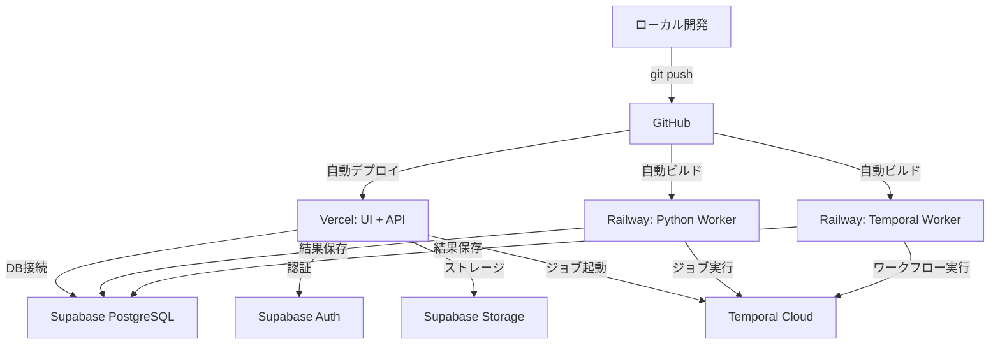

# Vercel + Supabase デプロイガイド

## 概要

このドキュメントでは、Agent StoreをVercel + Supabaseを中心としたクラウド環境にデプロイする方法を説明します。

**重要**: Vercel + Supabaseは**どちらも無料枠が充実**しており、開発・プロトタイプ段階なら**完全無料**で運用可能です。

## V0とVercelの違い

- **V0**: VercelのAI UIジェネレーター（コードを生成するツール）
- **Vercel**: デプロイ・ホスティングプラットフォーム（Next.js/Node.js向け）

## 料金体系の概要

### Vercel 無料プラン (Hobby)
- 帯域幅: 100GB/月
- ビルド時間: 6,000分/月
- Serverless Functions: 100時間/月
- **制限**: Function実行タイムアウト10秒

### Supabase 無料プラン (Free)
- データベース: 500MB
- ストレージ: 1GB
- 帯域幅: 5GB/月（DB） + 2GB/月（Storage）
- **制限**: 7日間非アクティブで一時停止（再開は1クリック）

### Railway 無料枠
- $5クレジット/月（約500時間の軽量コンテナ実行相当）
- **制限**: クレジット消費後は停止

**結論**: 開発・プロトタイプ段階なら**完全無料〜月$5程度**で運用可能！

## 現在のアーキテクチャ

### 主要コンポーネント

1. **Express API** (Node.js/TypeScript) - [api/](../api/)
2. **Python Inspect Worker** - [prototype/inspect-worker/](../prototype/inspect-worker/)
3. **Temporal Workflow** (Node.js) - [prototype/temporal-review-workflow/](../prototype/temporal-review-workflow/)
4. **Next.js Review UI** - [review-ui/](../review-ui/)
5. **PostgreSQL Database**
6. **Sandbox Runner** (Python CLI)

## Vercel + Supabaseでの実現可能性

### ✅ Vercelで可能な部分

#### 1. Next.js Review UI
- Vercelの主要ユースケース
- **完全対応**: そのままデプロイ可能
- ビルド時間: 1-3分
- 自動プレビューデプロイ対応

#### 2. Express API
- Vercel Serverless Functions（Node.js）として**移植可能**
- 各エンドポイントをAPI Routesに変換する必要あり
- **実行時間制限**:
  - Hobby: 10秒
  - Pro: 60秒
  - Enterprise: 300秒

#### 3. Temporal Workflow
- Node.jsベースなので**理論上は可能**
- **問題**: Temporal Workerは常駐プロセスが必要
- Vercelのサーバーレス環境では**常駐不可**
- **解決策**: Temporal Cloud + Vercel Edge Configで連携

### ❌ Vercelで困難な部分

#### 1. Python Inspect Worker
- Vercelは**Pythonランタイムをサポートしていない**（2025年1月時点）
- **完全に不可**
- **解決策**: 別サービス必須（Railway, Fly.io, Cloud Run等）

#### 2. Sandbox Runner
- Python製CLI
- セキュリティ隔離が必要
- Vercelでは**実行不可**
- **解決策**: コンテナサービス（Cloud Run, Railway, Fly.io等）

#### 3. 長時間実行タスク
- LLM Judge評価、セキュリティスキャンなど
- Vercelの実行時間制限を超える可能性が高い
- **解決策**: バックグラウンドジョブサービス

### ✅ Supabaseで可能な部分

#### 1. PostgreSQL Database
- 現在のスキーマをそのまま移行可能
- [db/migrations/](../db/migrations/)のマイグレーションも対応
- Connection pooling対応
- 最大500接続（Pro）

#### 2. Storage
- Agent Cards、審査レポート、アーティファクトの保存
- S3互換API
- CDN統合

#### 3. Auth
- 事業者認証
- レビュワー権限管理
- Row Level Security (RLS)との統合

#### 4. Edge Functions (Deno)
- **重要**: Pythonは使えないが、**DenoでTypeScript実行可能**
- 軽量なワークフローに利用可能
- Inspect Worker相当の処理は困難
- タイムアウト: 150秒（通常）、500秒（Pro）

#### 5. Realtime
- 審査進捗のリアルタイム通知に活用可能
- WebSocket経由でクライアントに即座に反映

## 推奨アーキテクチャ

```
┌─────────────────────────────────────────────────────┐
│ Vercel                                              │
│ ├─ Next.js Review UI (フロントエンド)              │
│ ├─ API Routes (軽量API: 提出受付、メタデータ取得) │
│ └─ Edge Middleware (認証、レート制限)              │
└─────────────────────────────────────────────────────┘
                    ↓
┌─────────────────────────────────────────────────────┐
│ Supabase                                            │
│ ├─ PostgreSQL (Agent Cards, Submissions, Reviews)  │
│ ├─ Auth (事業者認証、レビュワー権限管理)           │
│ ├─ Storage (レポート、ログ、アーティファクト)      │
│ ├─ Edge Functions (Webhook処理、通知)              │
│ └─ Realtime (審査ステータス更新の購読)             │
└─────────────────────────────────────────────────────┘
                    ↓
┌─────────────────────────────────────────────────────┐
│ Railway / Fly.io / Google Cloud Run (選択)         │
│ ├─ Python Inspect Worker (Dockerコンテナ)         │
│ ├─ Sandbox Runner (セキュリティ隔離環境)          │
│ └─ Temporal Worker (Node.js常駐プロセス)          │
└─────────────────────────────────────────────────────┘
                    ↓
┌─────────────────────────────────────────────────────┐
│ Temporal Cloud (オプション)                        │
│ └─ Workflow Orchestration                          │
└─────────────────────────────────────────────────────┘
```

## 具体的な移行プラン

### Phase 1: フロントエンド + DB（最優先）

#### 1.1 Supabaseプロジェクト作成

```bash
# Supabase CLIインストール
npm install -g supabase

# ログイン
supabase login

# プロジェクト初期化
supabase init

# ローカルでテスト
supabase start
```

#### 1.2 マイグレーション適用

```bash
# 既存のマイグレーションをSupabaseに適用
cp db/migrations/*.sql supabase/migrations/

# マイグレーション実行
supabase db push
```

#### 1.3 Review UIをVercelにデプロイ

```bash
# review-ui ディレクトリに移動
cd review-ui

# Vercel CLIインストール
npm install -g vercel

# デプロイ
vercel

# 環境変数設定
vercel env add NEXT_PUBLIC_API_URL
vercel env add NEXT_PUBLIC_SUPABASE_URL
vercel env add NEXT_PUBLIC_SUPABASE_ANON_KEY
```

**必要な環境変数:**
- `NEXT_PUBLIC_API_URL`: API のURL（初期は同じVercelプロジェクトのAPI Routes）
- `NEXT_PUBLIC_SUPABASE_URL`: Supabaseプロジェクト URL
- `NEXT_PUBLIC_SUPABASE_ANON_KEY`: Supabase匿名キー

### Phase 2: API層の移行

#### 2.1 Express APIをVercel API Routesに変換

**変換例:**

既存のExpress (`api/routes/reviews.ts`):
```typescript
app.get('/api/reviews/:id', (req, res) => {
  // ...
});
```

Vercel API Route (`pages/api/reviews/[id].ts`):
```typescript
import type { NextApiRequest, NextApiResponse } from 'next';

export default async function handler(
  req: NextApiRequest,
  res: NextApiResponse
) {
  const { id } = req.query;
  // ...
}
```

#### 2.2 軽量エンドポイントから段階的移行

**優先順位:**
1. GET エンドポイント（メタデータ取得、レビュー一覧）
2. POST エンドポイント（軽量な更新処理）
3. 重い処理は外部サービスにオフロード

#### 2.3 Supabase Clientの統合

```typescript
import { createClient } from '@supabase/supabase-js';

const supabase = createClient(
  process.env.NEXT_PUBLIC_SUPABASE_URL!,
  process.env.SUPABASE_SERVICE_ROLE_KEY!
);

// Agent Cardの取得例
const { data, error } = await supabase
  .from('agent_cards')
  .select('*')
  .eq('id', agentId)
  .single();
```

### Phase 3: Python Worker配置

#### 3.1 Railwayへのデプロイ（推奨）

**理由:**
- Dockerサポート
- 長時間実行可能
- 環境変数管理が簡単
- GitHubと自動連携
- 比較的低コスト（$5~/月）

**手順:**

1. Railway CLIインストール:
```bash
npm i -g @railway/cli
```

2. プロジェクト作成:
```bash
railway login
railway init
```

3. `railway.json`作成:
```json
{
  "$schema": "https://railway.app/railway.schema.json",
  "build": {
    "builder": "DOCKERFILE",
    "dockerfilePath": "docker/inspect-worker/Dockerfile"
  },
  "deploy": {
    "startCommand": "python -m inspect_worker.cli",
    "restartPolicyType": "ON_FAILURE",
    "restartPolicyMaxRetries": 10
  }
}
```

4. 環境変数設定:
```bash
railway variables set WANDB_API_KEY=<your-key>
railway variables set OPENAI_API_KEY=<your-key>
railway variables set SUPABASE_URL=<your-url>
railway variables set SUPABASE_SERVICE_ROLE_KEY=<your-key>
```

5. デプロイ:
```bash
railway up
```

#### 3.2 Fly.ioへのデプロイ（代替案）

```bash
# Fly CLI インストール
curl -L https://fly.io/install.sh | sh

# アプリ作成
fly launch --dockerfile docker/inspect-worker/Dockerfile

# 環境変数設定
fly secrets set WANDB_API_KEY=<your-key>
fly secrets set OPENAI_API_KEY=<your-key>

# デプロイ
fly deploy
```

#### 3.3 Google Cloud Runへのデプロイ（スケーラビリティ重視）

```bash
# プロジェクト設定
gcloud config set project <your-project-id>

# イメージビルド
gcloud builds submit --tag gcr.io/<your-project-id>/inspect-worker

# デプロイ
gcloud run deploy inspect-worker \
  --image gcr.io/<your-project-id>/inspect-worker \
  --platform managed \
  --region us-central1 \
  --memory 2Gi \
  --timeout 3600 \
  --set-env-vars "WANDB_API_KEY=<your-key>,OPENAI_API_KEY=<your-key>"
```

### Phase 4: Temporal統合

#### 4.1 Temporal Cloudアカウント作成

1. https://cloud.temporal.io/ でサインアップ
2. Namespace作成
3. 認証情報取得

#### 4.2 Temporal WorkerをRailway/Fly.ioにデプロイ

**Railway の場合:**

```bash
# 新しいサービス作成
railway init

# 環境変数設定
railway variables set TEMPORAL_ADDRESS=<namespace>.tmprl.cloud:7233
railway variables set TEMPORAL_NAMESPACE=<your-namespace>
railway variables set TEMPORAL_CLIENT_CERT=<base64-cert>
railway variables set TEMPORAL_CLIENT_KEY=<base64-key>

# デプロイ
railway up --dockerfile docker/temporal-worker/Dockerfile
```

#### 4.3 VercelからTemporal Workflowを起動

```typescript
// pages/api/submissions/index.ts
import { Connection, Client } from '@temporalio/client';

const connection = await Connection.connect({
  address: process.env.TEMPORAL_ADDRESS!,
  tls: {
    clientCertPair: {
      crt: Buffer.from(process.env.TEMPORAL_CLIENT_CERT!, 'base64'),
      key: Buffer.from(process.env.TEMPORAL_CLIENT_KEY!, 'base64'),
    },
  },
});

const client = new Client({ connection });

await client.workflow.start('reviewPipeline', {
  taskQueue: 'review-tasks',
  workflowId: `review-${submissionId}`,
  args: [submissionData],
});
```

### Phase 5: ジョブキューの統合（オプション）

長時間タスクをバックグラウンド実行するため、以下のいずれかを選択:

#### Option A: Supabase Edge Functions + pg_cron

```sql
-- Supabase内でcronジョブ設定
SELECT cron.schedule(
  'process-pending-reviews',
  '*/5 * * * *', -- 5分ごと
  $$
  SELECT process_pending_reviews();
  $$
);
```

#### Option B: Inngest（推奨）

- Vercel統合が簡単
- 長時間タスク対応
- リトライ・スケジューリング機能

```bash
npm install inngest

# pages/api/inngest.ts で設定
```

## 環境変数管理

### Vercel環境変数

```bash
# Production
vercel env add NEXT_PUBLIC_SUPABASE_URL production
vercel env add NEXT_PUBLIC_SUPABASE_ANON_KEY production
vercel env add SUPABASE_SERVICE_ROLE_KEY production
vercel env add TEMPORAL_ADDRESS production
vercel env add TEMPORAL_CLIENT_CERT production
vercel env add TEMPORAL_CLIENT_KEY production

# Preview
vercel env add NEXT_PUBLIC_SUPABASE_URL preview

# Development
vercel env add NEXT_PUBLIC_SUPABASE_URL development
```

### Railway環境変数

```bash
railway variables set SUPABASE_URL=<url>
railway variables set SUPABASE_SERVICE_ROLE_KEY=<key>
railway variables set WANDB_API_KEY=<key>
railway variables set OPENAI_API_KEY=<key>
railway variables set TEMPORAL_ADDRESS=<address>
```

### .env.example テンプレート

```bash
# Supabase
NEXT_PUBLIC_SUPABASE_URL=https://xxxxx.supabase.co
NEXT_PUBLIC_SUPABASE_ANON_KEY=eyJxxx...
SUPABASE_SERVICE_ROLE_KEY=eyJxxx...

# Temporal
TEMPORAL_ADDRESS=localhost:7233
TEMPORAL_NAMESPACE=default
TEMPORAL_CLIENT_CERT=
TEMPORAL_CLIENT_KEY=

# Observability
WANDB_API_KEY=
WANDB_PROJECT=agent-store-sandbox
WANDB_ENTITY=

# LLM
OPENAI_API_KEY=

# API
ALLOWED_ORIGINS=https://your-app.vercel.app
RATE_LIMIT_WINDOW_MS=60000
RATE_LIMIT_MAX=120
```

## コスト試算（月額）

### 無料枠での運用（開発・プロトタイプ段階）

| サービス | プラン | 無料枠の範囲 | 制限事項 |
|---------|-------|------------|---------|
| Vercel | Hobby（無料） | 帯域100GB/月、ビルド6000分/月 | Function実行10秒まで、1人のみ |
| Supabase | Free（無料） | DB 500MB、Storage 1GB、帯域5GB/月 | 7日間非アクティブで一時停止 |
| Railway | Trial（無料） | $5クレジット/月 | クレジット消費後は停止 |
| Temporal | セルフホスト | Railwayで実行可能 | 運用負荷あり |
| **合計** | - | **完全無料〜$5/月** | 小規模利用に限定 |

**無料枠で運用できる条件:**
- 月間トラフィック: 100GB以内
- データベースサイズ: 500MB以内
- Python Worker実行: 月間数時間程度
- 審査件数: 月10-50件程度

### 有料プランでの運用（本番・スケール段階）

| サービス | プラン | 用途 | 推定コスト |
|---------|-------|------|-----------|
| Vercel | Pro | Next.js UI + API Routes | $20 |
| Supabase | Pro | PostgreSQL + Storage + Auth | $25 |
| Railway | Hobby → Developer | Python Worker + Temporal Worker | $5-20 |
| Temporal Cloud | Basic（または自前） | ワークフロー管理 | $200~ or $0 |
| Inngest | Free → Pro | バックグラウンドジョブ（オプション） | $0-20 |
| **合計（基本構成）** | - | - | **$50-65/月** |
| **合計（Temporal Cloud含む）** | - | - | **$250-285/月** |

### コスト最適化オプション

#### Temporal自前ホスティング（$0）

RailwayまたはFly.ioでTemporal Serverを自前ホスティング:

```bash
# docker-compose.ymlをRailwayにデプロイ
railway up --service temporal-server
```

**トレードオフ:**
- コスト: $0-5/月（Railway Hobbyプラン範囲内）
- 運用負荷: 高（アップグレード、モニタリング、バックアップが必要）
- 可用性: Temporal Cloudより低い

## デプロイフロー



## モニタリング・ロギング

### Vercel Analytics

```bash
# package.json に追加
npm install @vercel/analytics

# _app.tsx で有効化
import { Analytics } from '@vercel/analytics/react';

export default function App({ Component, pageProps }) {
  return (
    <>
      <Component {...pageProps} />
      <Analytics />
    </>
  );
}
```

### Supabase Logs

```bash
# Supabase CLI でログ確認
supabase logs --db
supabase logs --api
supabase logs --auth
```

### Railway Logs

```bash
# Railway CLI でログ確認
railway logs
railway logs --follow
```

### W&B（既存の統合）

- Temporal WorkflowからW&B Run IDを渡す
- Inspect Workerがメトリクスをログ

## トラブルシューティング

### Vercelのタイムアウトエラー

**問題**: API RouteでタイムアウトエラーNODE_ENV=production

**解決策**:
1. 処理を軽量化
2. Railway/Fly.ioにオフロード
3. Vercel Enterpriseプランにアップグレード（300秒）

### Supabase接続プールエラー

**問題**: `remaining connection slots reserved for non-replication superuser connections`

**解決策**:
```typescript
// Supapavisorを使用（推奨）
const supabase = createClient(
  process.env.NEXT_PUBLIC_SUPABASE_URL!.replace(
    'https://',
    'https://aws-0-'
  ),
  process.env.SUPABASE_SERVICE_ROLE_KEY!
);
```

### Railway メモリ不足

**問題**: Python Workerがメモリ不足でクラッシュ

**解決策**:
```bash
# railway.json でメモリ上限を増やす
{
  "deploy": {
    "memoryLimit": "2Gi"
  }
}
```

## セキュリティ考慮事項

### Row Level Security (RLS)

```sql
-- agent_cards テーブルのRLS
ALTER TABLE agent_cards ENABLE ROW LEVEL SECURITY;

-- 公開済みのみ閲覧可能
CREATE POLICY "Public cards are viewable by anyone"
  ON agent_cards FOR SELECT
  USING (status = 'approved');

-- 事業者は自分のカードのみ編集可能
CREATE POLICY "Operators can update own cards"
  ON agent_cards FOR UPDATE
  USING (auth.uid() = operator_id);
```

### API Rate Limiting

Vercel Edge Middlewareで実装:

```typescript
// middleware.ts
import { Ratelimit } from '@upstash/ratelimit';
import { Redis } from '@upstash/redis';

const ratelimit = new Ratelimit({
  redis: Redis.fromEnv(),
  limiter: Ratelimit.slidingWindow(10, '10 s'),
});

export async function middleware(request: Request) {
  const ip = request.headers.get('x-forwarded-for');
  const { success } = await ratelimit.limit(ip);

  if (!success) {
    return new Response('Too Many Requests', { status: 429 });
  }
}
```

### 環境変数の暗号化

```bash
# Vercelでシークレットを暗号化
vercel env add DATABASE_URL production --sensitive

# Railwayでもシークレット管理対応
railway variables set OPENAI_API_KEY --sensitive
```

## CI/CD

### GitHub Actions例

```yaml
# .github/workflows/deploy.yml
name: Deploy to Vercel + Railway

on:
  push:
    branches: [main]

jobs:
  deploy-vercel:
    runs-on: ubuntu-latest
    steps:
      - uses: actions/checkout@v3
      - name: Deploy to Vercel
        run: vercel --prod --token=${{ secrets.VERCEL_TOKEN }}

  deploy-railway:
    runs-on: ubuntu-latest
    steps:
      - uses: actions/checkout@v3
      - name: Deploy to Railway
        run: railway up --service inspect-worker
        env:
          RAILWAY_TOKEN: ${{ secrets.RAILWAY_TOKEN }}
```

## 参考リンク

- [Vercel Documentation](https://vercel.com/docs)
- [Supabase Documentation](https://supabase.com/docs)
- [Railway Documentation](https://docs.railway.app/)
- [Temporal Cloud Documentation](https://docs.temporal.io/cloud)
- [Fly.io Documentation](https://fly.io/docs/)

## まとめ

**Vercel + Supabaseでの運用は可能ですが、Pythonコンポーネントは別サービスが必須です。**

### 推奨構成
- **Vercel**: Next.js UI + 軽量API Routes
- **Supabase**: PostgreSQL + Auth + Storage + Realtime
- **Railway/Fly.io**: Python Inspect Worker + Temporal Worker（Dockerコンテナ）
- **Temporal Cloud（オプション）**: ワークフローオーケストレーション

この構成なら**月額$50-65程度**（Temporal自前ホスティング時）で運用可能で、スケーラビリティも確保できます。
